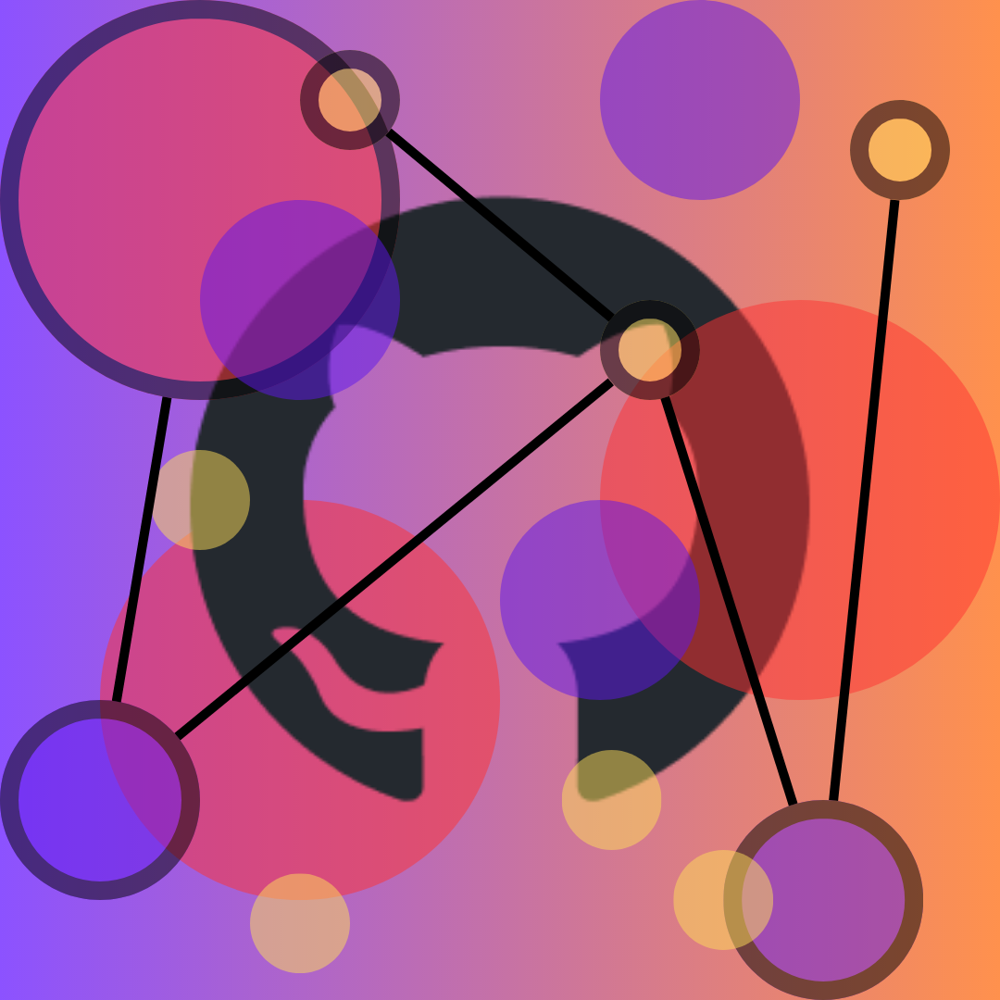

<table style="background-color: #ffffff; border: none;">
  <tr style="background-color: #ffffff;">
    <td style="background-color: #ffffff;">
      

        
      

    </td>
    <td style="background-color: #ffffff;">
      

        <h3>Hi👋, I'm Yonatan (Yoni) Abrams - a Data Scientist</h3>
        
<strong>Welcome to my GitHub page!</strong>

      

    </td>
  </tr>
  <tr style="background-color: #ffffff;">
    <td style="background-color: #ffffff;">
      

        
      

    </td>
    <td rowspan="2" style="background-color: #ffffff;">
      

        
<strong>I would love you to check out my work:</strong>

      

      <ul style="background-color: #ffffff;">
        <li>Hopefully what you find below is interesting, helpful, or even <strong>both!</strong></li>
        <li>I had a lot of fun cracking my head on everything you'll find here!</li>
      </ul>
      

        <h4>Feel Free to reach out with questions or with project ideas! You can find me on LinkedIn:</h4>
        

          <a href="https://www.linkedin.com/in/yabrams" target="_blank">LinkedIn Profile</a>
        

      

    </td>
  </tr>
  <tr style="background-color: #ffffff;">
    <td style="background-color: &#35;ffffff;">
      

        
      

    </td>
  </tr>
</table>
